## Hey, Sanders Gutiérrez here! 👋

I'm **[Sanders Gutiérrez](https://linkeding.com/in/sandersgutierrez)**, a **Senior Software Engineer** from [Condoto - Chocó, Colombia](https://www.google.com/maps/place/Condoto,+Choco,+Colombia/@5.089546,-76.6535219,16z/data=!3m1!4b1!4m5!3m4!1s0x8e48100361370285:0x8ca43199f1c90a20!8m2!3d5.089546!4d-76.652079), resident in Argentine. I currently work as a Freelance Software Developer and as a Java Programming Teacher at [DigitalHouse](https://www.digitalhouse.com/ar).

-   :package: Building [Posta En Línea](https://postaenlinea.com/) and more
-   :pencil2: Arch Linux / KWin-wm / Oh My Zsh / Intellij IDEA Ultimate / Google Chrome
-   :key: GPG key: [`02BA7CBBE8FDF22A`](https://github.com/sandersgutierrez.gpg)

---

